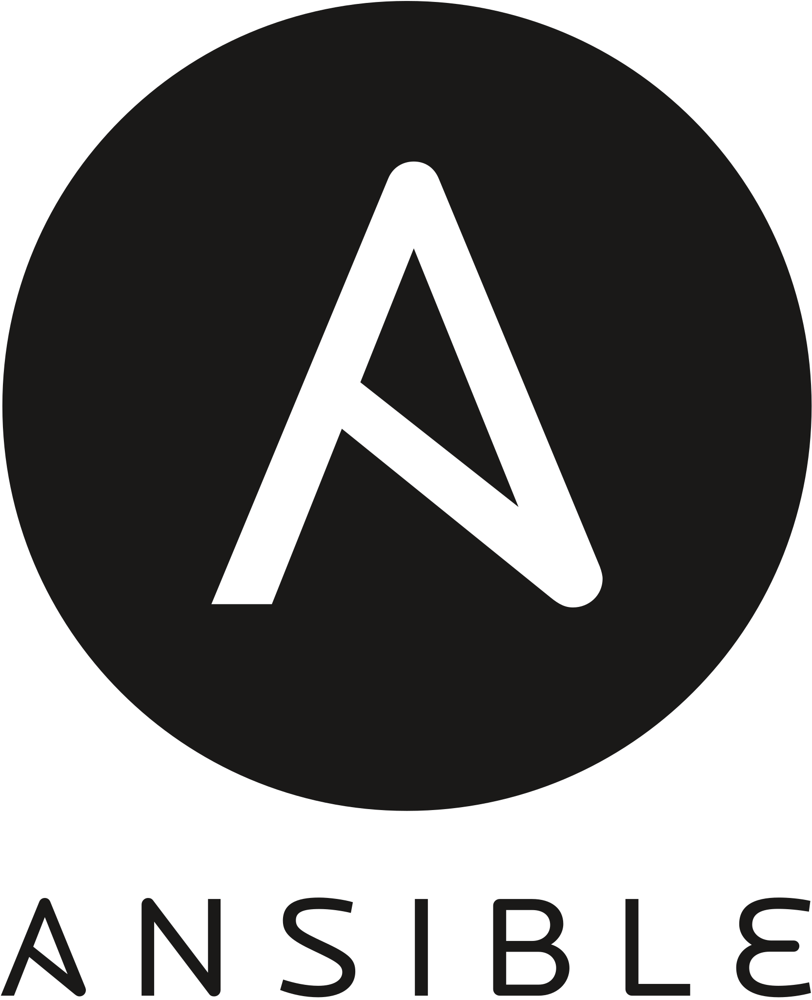

# Learn - Terraform + Ansible + AWS

Project to learn about infra as code. In this project, a wordpress blog is provisioned in AWS with RDS as database using Terraform and Ansible. This project is a task of SRE Eleven Works course.

# Recursos Obrigatórios:
## Terraform
- [ ] VPC
- [ ] Subnet
- [ ] Route Tables
- [ ] Internet Gateway
- [ ] Security Groups

- [ ] RDS
- [ ] EC2 Instance

## Ansible
- [ ] nginx
- [ ] php-fpm
- [ ] WordPress

# Recursos Opcionais:
- [ ] Memcache
- [ ] Load Balancer
- [ ] Auto Scaling
- [ ] Alta Disponibilidade com Multi AZ
- [ ] CDN/WAF: Cloudflare + Serviço WAF

# Commands Makefile
| Command          | Description                          |
|-----------------:|:-------------------------------------|
| init             | Init terraform                       |
| plan             | Show terraform changes               |
| up               | Apply terraform changes              |
| rebuild-instance | Recreate EC2 instance with Ansible   |
| down             | Destroy terraform resources          |